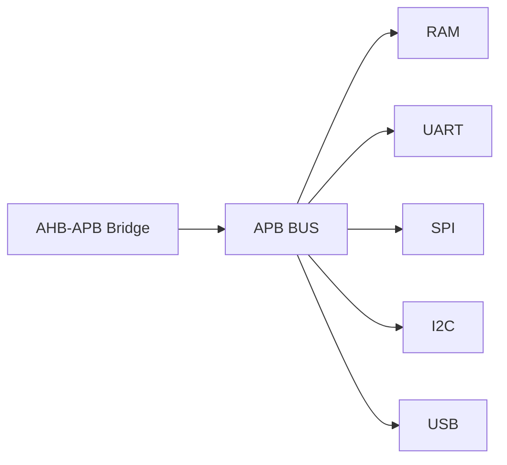
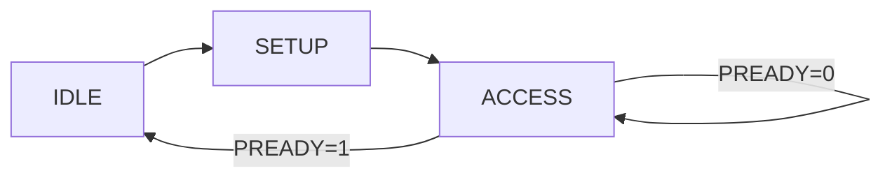

<h1 align="center"> APB Bus (Advanced Peripheral Bus) - Verilog RTL Design </h1>

<p align="center">


</p>

<p align="center">


</p>

---

<p align="center">
This project implements an <b>AMBA APB (Advanced Peripheral Bus)</b> interconnect in Verilog, enabling communication between an <b>AHB-APB bridge (master)</b> and multiple <b>peripheral slaves</b>.
</p>

---

# Overview

- Low-power, low-complexity on-chip bus  
- Non-pipelined protocol  
- Two-phase transfer: SETUP → ACCESS  
- Used for peripheral register access  

APB is designed for **simple register-level communication**, making it ideal for low-speed peripherals.

---

# APB Architecture



The APB bus connects a single master (bridge) to multiple slaves using **address-based selection**.

---

# APB Transfer Phases



- **SETUP Phase**: Address and control signals are driven  
- **ACCESS Phase**: Data transfer happens  
- **PREADY** allows insertion of wait states  

This simple state machine ensures predictable timing.

---

# Types of Transfers

## Write Transfer


- PWRITE = 1  
- Master drives data on PWDATA  
- Slave captures data  

**Condition:**
- PSEL = 1 during SETUP phase  
- PENABLE = 1 during ACCESS phase  
- Transfer completes when PREADY = 1  

## Read Transfer


- PWRITE = 0  
- Slave drives data on PRDATA  
- Master samples data  

**Condition:**
- PSEL = 1 and PENABLE = 1  
- PRDATA valid when PREADY = 1  
- Data must be stable at end of ACCESS phase  

## Write Transfer (No Wait State)


- Data accepted immediately  
- Single ACCESS cycle  

**Condition:**
- PREADY = 1 in first ACCESS cycle  
- Transfer completes in 2 cycles (SETUP + ACCESS)  
- Signals remain stable throughout transfer :contentReference[oaicite:0]{index=0}  


## Read Transfer (No Wait State)


- Data returned without delay  
- No stall cycles  

**Condition:**
- PREADY = 1 during ACCESS phase  
- PRDATA valid before end of transfer  
- Completes in 2 cycles :contentReference[oaicite:1]{index=1}  


## Write Transfer (With Wait State)


- Slave delays data acceptance  
- Multiple ACCESS cycles  

**Condition:**
- PREADY = 0 for one or more cycles  
- PADDR, PWRITE, PSEL, PWDATA remain stable  
- Transfer completes when PREADY = 1  

## Read Transfer (With Wait State)


- Slave delays data response  
- Data available after wait  

**Condition:**
- PREADY = 0 extends ACCESS phase  
- PRDATA valid only when PREADY = 1  
- Control signals remain unchanged
  
## Transfer with Wait States

- Slave inserts delay using PREADY = 0  
- Master holds all signals stable  

**Condition:**
- PENABLE = 1 while waiting  
- PADDR, PWRITE, PSEL, PWDATA remain unchanged  
- Transfer completes when PREADY transitions to 1 :contentReference[oaicite:2]{index=2}  


## Error Transfer

- PSLVERR = 1 indicates failure  
- Can occur in read or write  

**Condition:**
- Valid only when PSEL = 1, PENABLE = 1, PREADY = 1  
- Error reported in final cycle of transfer :contentReference[oaicite:3]{index=3}  

---

# Signal Description

| Signal | Direction | Description |
|--------|----------|-------------|
| PADDR  | Input  | Address bus |
| PWRITE | Input  | Write (1) / Read (0) |
| PSEL   | Input  | Slave select |
| PENABLE| Input  | Enables transfer phase |
| PWDATA | Input  | Write data |
| PRDATA | Output | Read data |
| PREADY | Output | Transfer complete |
| PSLVERR| Output | Error signal |

These signals form the **core APB handshake**, controlling address, data, and transfer completion.

---

# Address Mapping

| Address Range | Peripheral |
|--------------|-----------|
| 0x0000_0000  | RAM |
| 0x0000_1000  | UART |
| 0x0000_2000  | SPI |
| 0x0000_3000  | I2C |
| 0x0000_4000  | USB |

The address space is divided into **fixed regions**, each mapped to a specific peripheral.

---

# Decoder Logic

```verilog
assign psel_ram  = psel & (paddr[15:12] == 4'h0);
assign psel_uart = psel & (paddr[15:12] == 4'h1);
assign psel_spi  = psel & (paddr[15:12] == 4'h2);
assign psel_i2c  = psel & (paddr[15:12] == 4'h3);
assign psel_usb  = psel & (paddr[15:12] == 4'h4);
```

The decoder uses upper address bits to **select one slave at a time**, ensuring only one peripheral is active.

---

# Data Path (Mux Logic)

```verilog
always @(*) begin
    case (paddr[15:12])
        4'h0: begin prdata=prdata_ram; pready=pready_ram; pslverr=pslverr_ram; end
        4'h1: begin prdata=prdata_uart; pready=pready_uart; pslverr=pslverr_uart; end
        4'h2: begin prdata=prdata_spi; pready=pready_spi; pslverr=pslverr_spi; end
        4'h3: begin prdata=prdata_i2c; pready=pready_i2c; pslverr=pslverr_i2c; end
        4'h4: begin prdata=prdata_usb; pready=pready_usb; pslverr=pslverr_usb; end
        default: begin prdata=32'h0; pready=1'b1; pslverr=1'b1; end
    endcase
end
```

This logic **multiplexes outputs** from the selected slave back to the master.

---

# Data Flow


- CPU generates transaction  
- AHB handles high-speed transfer  
- Bridge converts protocol  
- APB delivers data to peripheral  

---

# Key Features

- Address-based slave selection  
- Simple two-phase protocol  
- Support for wait states and errors  
- Scalable architecture  

---

# Role in SoC

- Acts as **low-speed peripheral bus**  
- Reduces complexity compared to high-speed buses  
- Enables modular integration of peripherals  

---

<p align="center"><b>
This APB implementation provides a clean and scalable interconnect for integrating multiple peripherals into a SoC using AMBA standards.
</p>

---
